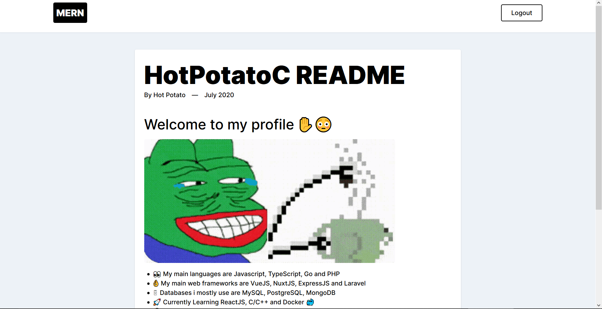

<h1 align='center'>
🚀 MERN Markdown Blog
</h1>
<p align='center'>
MongoDB, ExpressJs, ReactJs, NodeJs
</p>

A blogging application made with the MERN stack with **Dockerization** and **TypeScript** as the backend language.



# Getting Started

Cloning the repository

```bash
$ git clone https://github.com/HotPotatoC/mern-markdown-blog.git

$ cd mern-markdown-blog
```

## Running with docker-compose

To start the application with docker, make sure you have [**docker-compose**](https://docs.docker.com/compose/install/) installed.

```bash
$ docker-compose -v
```

If you already have docker-compose installed, Build the containers

```bash
$ docker-compose build
```

Run the application

```bash
$ docker-compose up -d
```

The ReactJs application will run on _http://localhost:3000_ and the Express application will run on _http://localhost:5000_

To stop the application run

```bash
$ docker-compose stop
```

## Running without docker-compose

To run the application without using docker. Run your MongoDB service

```bash
$ sudo service mongodb start
```

Starting the server application

```bash
$ cd server
$ yarn install
$ yarn dev
```

Starting the client application

```bash
$ cd client
$ yarn install
$ yarn start
```

The ReactJs application will run on _http://localhost:3000_ and the Express application will run on _http://localhost:5000_

# Tools & Packages

## Client-Side
| Package Name     | Description                                                                | Version |
|------------------|----------------------------------------------------------------------------|---------|
| axios            | Promise based HTTP client for the browser and node.js                      | ^0.19.2 |
| highlight.js     | Syntax highlighting with language autodetection.                           | ^10.1.2 |
| moment           | Parse, validate, manipulate, and display dates                             | ^2.27.0 |
| react-feather    | React component for Feather icons                                          | ^2.0.8  |
| react-highlight  | React component for syntax highlighting                                    | ^0.12.0 |
| react-markdown   | Renders Markdown as React components                                       | ^4.3.1  |
| react-moment     | React component for the moment date library.                               | ^0.9.7  |
| react-router-dom | DOM bindings for React Router                                              | ^5.2.0  |
| tailwindcss      | A utility-first CSS framework for rapidly building custom user interfaces. | ^1.5.2  |

## Server-Side

| Package Name         | Description                                                                     | Version |
|----------------------|---------------------------------------------------------------------------------|---------|
| @hapi/joi            | Object schema validation                                                        | ^17.1.1 |
| @typegoose/typegoose | Define Mongoose models using TypeScript classes                                 | ^7.3.0  |
| bcrypt               | A bcrypt library for NodeJS.                                                    | ^5.0.0  |
| cors                 | Node.js CORS middleware                                                         | ^2.8.5  |
| dotenv               | Loads environment variables from .env file                                      | ^8.2.0  |
| express              | Fast, unopinionated, minimalist web framework                                   | ^4.17.1 |
| jsonwebtoken         | JSON Web Token implementation (symmetric and asymmetric)                        | ^8.5.1  |
| mongoose             | Mongoose MongoDB ODM                                                            | 5.9.22  |
| mongoose-paginate-v2 | A cursor based custom pagination library for Mongoose with customizable labels. | ^1.3.9  |
| morgan               | HTTP request logger middleware for node.js                                      | ^1.10.0 |
| slugify              | Slugifies a String                                                              | ^1.4.4  |
| nodemon              | Simple monitor script for use during development of a node.js app.              | ^2.0.4  |